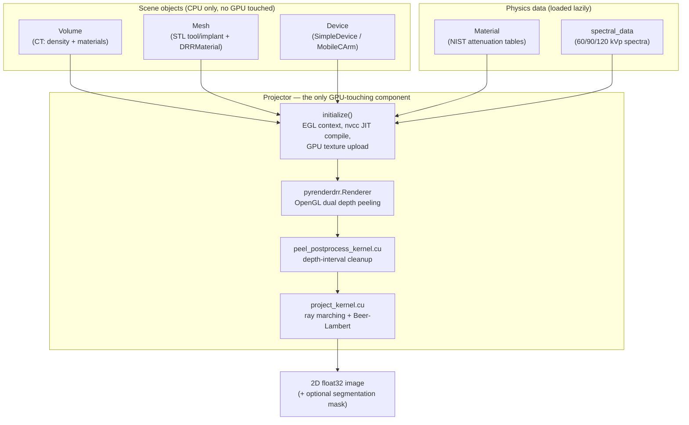
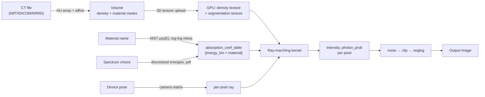
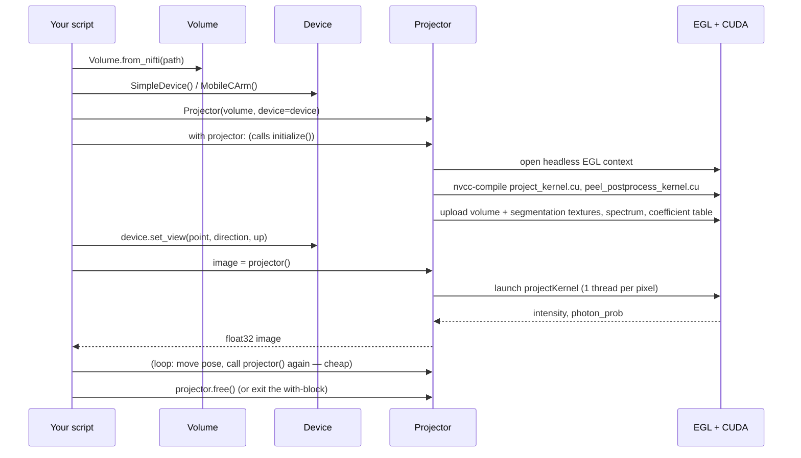
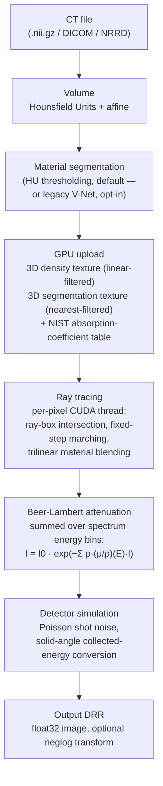

<div align="center">

# DeepDRR

**GPU-accelerated simulation of X-ray images (DRRs) from CT volumes and 3D meshes.**

[](https://arxiv.org/abs/1803.08606)
[](https://pepy.tech/project/deepdrr)
[](https://github.com/arcadelab/deepdrr/releases/)
[](https://pypi.org/project/deepdrr/)
[](http://deepdrr.readthedocs.io/?badge=latest)
[](https://github.com/psf/black)
[](https://colab.research.google.com/github/arcadelab/deepdrr/blob/main/deepdrr_demo.ipynb)
[](LICENSE)

</div>

---

## Table of Contents

1. [Project Overview](#1-project-overview)
2. [Features](#2-features)
3. [Repository Architecture](#3-repository-architecture)
4. [Folder Structure](#4-folder-structure)
5. [Installation](#5-installation)
6. [Quick Start](#6-quick-start)
7. [How the Rendering Pipeline Works](#7-how-the-rendering-pipeline-works)
8. [Inputs](#8-inputs)
9. [Outputs](#9-outputs)
10. [Core Classes](#10-core-classes)
11. [Common Workflows](#11-common-workflows)
12. [Configuration](#12-configuration)
13. [GPU and Performance](#13-gpu-and-performance)
14. [Troubleshooting](#14-troubleshooting)
15. [Development Guide](#15-development-guide)
16. [FAQ](#16-faq)
17. [References](#17-references)

---

## 1. Project Overview

### What DeepDRR is

DeepDRR is a **GPU-based physics simulator** that produces **Digitally Reconstructed
Radiographs (DRRs)** — synthetic X-ray images — from 3D CT volumes and, optionally, 3D
triangle meshes (surgical tools, implants, screws). It renders how an X-ray image
*would* look if a real X-ray source and detector were placed at a given pose relative
to the CT anatomy, using energy-dependent attenuation physics rather than a learned
approximation of one.

### What problem it solves

Training computer-vision models for X-ray-guided procedures (segmentation, anatomical
landmark detection, tool tracking, pose estimation, view classification) requires large
amounts of labeled fluoroscopic image data. Real intraoperative fluoroscopy is:

- expensive and clinically disruptive to collect at scale,
- difficult to label with precise 3D ground truth (a real X-ray gives you no direct
  way to know the exact 3D pose, segmentation, or tool location that produced it),
- subject to patient dose limits.

DeepDRR sidesteps all three constraints: given an existing CT (e.g., from a public
archive), it can render an effectively unlimited number of X-ray images from arbitrary
poses, with **exact, free ground truth** for every pixel — because the 3D scene that
produced the image is known by construction.

### Typical use cases

- Generating training data for 2D/3D registration between X-ray and CT/atlases
- Anatomical landmark detection in pelvic/spine fluoroscopy
- Surgical tool and instrument segmentation/pose estimation in X-ray
- Sim-to-real transfer learning for autonomous or voice-controlled robotic C-arms
- View-classification and automated standard-view acquisition
- Foundation-model pretraining for X-ray image understanding (e.g., FluoroSAM)

### How DeepDRR differs from DiffDRR and similar projects

DeepDRR is **not a differentiable renderer**. It is optimized for fast, realistic,
large-scale dataset generation — supporting multiple overlapping CT volumes and
mixed volume+mesh scenes with per-material physics — rather than for backpropagating
through the rendering process (e.g., for 2D/3D registration via gradient descent).

If you need gradients through the rendering process, use
[DiffDRR](https://github.com/eigenvivek/DiffDRR) or
[ProST](https://github.com/gaocong13/Projective-Spatial-Transformers) instead — both
follow the same underlying physics-based simulation principles as DeepDRR but trade
some of DeepDRR's raw throughput and multi-object compositing features for
differentiability.

### Why someone would use it

- You need **many** labeled X-ray images and don't have (or can't ethically collect)
  that many real ones.
- You need **exact 3D ground truth** (pose, segmentation, tool trajectory) that a
  real acquisition cannot give you.
- You need **realistic energy-dependent attenuation physics** (not just a projected
  intensity sum) — bone/soft-tissue/metal all attenuate differently as a function of
  X-ray energy, and DeepDRR models that explicitly.
- You want to combine a **patient CT with surgical tool/implant geometry** in a single
  rendered scene.

---

## 2. Features

| Capability | Details |
|---|---|
| CT → DRR generation | GPU ray-marching renderer with polychromatic Beer-Lambert attenuation |
| Multiple projection angles | Any camera pose via `Device.set_view()` or `MobileCArm` gantry angles (`alpha`, `beta`) |
| Mesh rendering | Dual-depth-peeling OpenGL renderer for STL tool/implant geometry, combinable with CT volumes |
| Device simulation | `SimpleDevice` (pedagogical look-at camera), `MobileCArm` (full C-arm gantry kinematics) |
| Physics-based rendering | Polychromatic Beer-Lambert attenuation; beam hardening emerges naturally from per-energy-bin integration — no learned shortcuts |
| Material attenuation | NIST-derived mass-attenuation-coefficient database: 92 elements + common tissue compounds (bone, blood, lung, muscle, soft tissue, air, titanium, iron, ...) |
| Multi-volume compositing | Render several overlapping CT volumes with configurable priority resolution |
| Detector noise | Analytic Poisson shot-noise model |
| Segmentation output | Per-tag binary tool/mesh masks (`project_seg`) alongside the DRR |
| Supported input formats | NIfTI, DICOM (Siemens Enhanced CT), NRRD, raw NumPy arrays, STL |
| Batch rendering | One-time GPU initialization per volume; cheap repeated rendering across poses |

> **Deprecated / not currently active:** Monte Carlo scatter simulation. The physics
> data (RITA angle/energy samplers, mean-free-path tables, Compton scattering data,
> all ported from MC-GPU/PENELOPE) still ships with the package, but passing
> `scatter_num > 0` to `Projector` raises a `DeprecationError` — scatter is disabled
> pending a rewrite. Only primary (unscattered) transmission is currently rendered.
>
> **Legacy / opt-in only:** Neural (V-Net) tissue segmentation. The default and
> recommended segmentation method is HU thresholding (`use_thresholding=True`, the
> default). The V-Net path (`use_thresholding=False`) downloads external pretrained
> weights and requires a CUDA GPU with PyTorch; it is retained for backward
> compatibility, not because it outperforms thresholding in general.
>
> **Deprecated:** `deepdrr.device.CArm`. Use `MobileCArm` instead — `CArm` used an
> incorrect angulation convention and is kept only for backward compatibility.

---

## 3. Repository Architecture

### Component diagram



### Data flow



### Execution flow



The key architectural point: **constructing** `Volume`/`Mesh`/`Device` objects and the
`Projector` itself does no GPU work. GPU memory allocation, CUDA kernel compilation, and
data upload all happen inside `Projector.initialize()` (or on entering a `with Projector(...)`
block) — a one-time cost per volume set. Every subsequent call to the projector (a new
pose) is comparatively cheap, which is why batch rendering should reuse one initialized
`Projector` across many poses rather than re-initializing per image (see
[§13](#13-gpu-and-performance)).

---

## 4. Folder Structure

```
deepdrr/
├── deepdrr/                 the installable Python package
│   ├── vol/                 Volume, Mesh, Renderable, KWire, MetalVolume — scene objects
│   ├── device/               Device, SimpleDevice, MobileCArm, CArm (deprecated), CameraProjectionDevice
│   ├── material/             Material physics + NIST attenuation-coefficient data tables
│   ├── projector/            THE CORE: Projector class, CUDA kernels (.cu), MC-GPU physics data
│   ├── pyrenderdrr/           OpenGL dual-depth-peeling mesh renderer + GLSL shaders
│   ├── geo/                   geometry re-export shim over the external `killeengeo` package
│   ├── annotations/           FiducialList / LineAnnotation — 3D-Slicer-compatible landmark I/O
│   ├── instruments/           Instrument base class — voxelizes STL tool models into Volumes
│   ├── segmentation.py, network_segmentation.py   legacy V-Net tissue segmentation (opt-in)
│   ├── load_dicom.py, load_dicom_tool.py           legacy HU→material conversion helpers
│   ├── downsample_tool.py                          legacy, currently unreferenced
│   ├── vis.py                                      PyVista debug visualization (not a production renderer)
│   ├── common.py, logging.py, __init__.py
│   └── utils/                shared I/O, image, mesh, CUDA, and test utilities
├── tests/                    pytest suite + reference images + STL fixtures
├── docs/                     Sphinx / Read-the-Docs configuration
├── notebooks/, deepdrr_demo.ipynb   Jupyter/Colab demos
├── scripts/                  setup_ubuntu.sh, test.sh, test_cov.sh, test_docker.sh
├── data/                     one bundled sample STL tool mesh (a cannulated screw)
├── example_projector.py, geometry_testing.py   standalone runnable examples
├── Dockerfile, docker-compose.yml, .dockerignore
├── pyproject.toml, setup.cfg, requirements.txt, environment.yml, MANIFEST.in
└── .github/workflows/publish.yaml   PyPI release automation (Trusted Publishing / OIDC)
```

| Folder | Purpose | Required for basic use? | Interacts with |
|---|---|---|---|
| `deepdrr/vol/` | CT/mesh scene-object model and coordinate-frame algebra | **Yes** | `projector/`, `device/`, `material/` |
| `deepdrr/device/` | X-ray source/detector geometry and pose | **Yes** | `projector/`, `geo` |
| `deepdrr/material/` | Attenuation-coefficient physics and data | **Yes** | `projector/`, `vol/`, `pyrenderdrr/` |
| `deepdrr/projector/` | Ray-tracing CUDA kernels and orchestration | **Yes** | everything |
| `deepdrr/pyrenderdrr/` | OpenGL mesh depth-peeling renderer | Only if rendering `Mesh` objects | `projector/` |
| `deepdrr/geo/` | Coordinate/geometry primitives (re-exports `killeengeo`) | **Yes** (transitively) | almost everything |
| `deepdrr/annotations/` | Landmark/trajectory ground-truth I/O | Optional | `vol.Volume` |
| `deepdrr/instruments/` | STL→Volume voxelization for tool models | Optional convenience | `mesh_utils`, `vol.Volume` |
| `deepdrr/segmentation.py` / `network_segmentation.py` | Legacy V-Net neural segmentation | No — thresholding is the default | `load_dicom.py` |
| `deepdrr/load_dicom_tool.py`, `downsample_tool.py` | Pre-STL-era tool/CT compositing | No — superseded by `instruments/` | none actively referenced |
| `tests/`, `docs/`, `notebooks/`, `scripts/` | Development, QA, and documentation infrastructure | Not needed at runtime | build/CI only |
| `deepdrr/projector/cubic/` | Third-party CUDA cubic B-spline interpolation library | No — currently unused (dead include) | `project_kernel.cu` (include only) |

---

## 5. Installation

### System requirements

- **Linux** (Ubuntu tested/documented). DeepDRR does **not** run on native Windows —
  see [§14 Troubleshooting](#14-troubleshooting) for why, and use WSL2 with GPU
  passthrough if Windows is your host OS.
- An **NVIDIA GPU** with a driver supporting your target CUDA Toolkit version.
- `git`, a C/C++ build toolchain, and `nvcc` on your `PATH` (CUDA kernels are compiled
  **at runtime**, not at install time).

### GPU requirements

- CUDA-capable NVIDIA GPU. There is no CPU rendering fallback — `Projector` requires
  CUDA.
- Enough free GPU memory to hold your CT's density + segmentation textures
  simultaneously (larger/higher-resolution volumes and more materials need more
  memory).
- Headless OpenGL/EGL support is required even without a physical display, because
  the mesh renderer uses off-screen OpenGL rendering. `scripts/setup_ubuntu.sh`
  configures this for you.

### CUDA compatibility

DeepDRR depends on [`cupy`](https://cupy.dev), which ships CUDA-version-specific
wheels. Install the extra matching `nvcc --version`:

| Your CUDA Toolkit | Install with |
|---|---|
| 10.2 | `pip install .[cuda102]` |
| 11.0 | `pip install .[cuda110]` |
| 11.1 | `pip install .[cuda111]` |
| 11.2 – 11.8 | `pip install .[cuda11x]` |
| 12.x | `pip install .[cuda12x]` |

See the [cupy installation guide](https://docs.cupy.dev/en/stable/install.html) if
you're unsure which applies to you.

### Conda installation (recommended)

```bash
# 1. Install NVIDIA drivers (e.g. on Ubuntu 22):
sudo ubuntu-drivers install --gpgpu nvidia:535-server

# 2. Install conda (mambaforge recommended: https://github.com/conda-forge/miniforge)

# 3. Clone and install
git clone https://github.com/arcadelab/deepdrr.git
cd deepdrr
sudo ./scripts/setup_ubuntu.sh          # apt dependencies + headless EGL driver config
conda env create -f environment.yml      # installs CUDA 12 toolkit + PyTorch
conda activate deepdrr
pip install .[cuda12x]                   # match this to your actual CUDA version
```

### Pip installation

If you already have a working CUDA + EGL environment (e.g., inside a container that
already ran `setup_ubuntu.sh`-equivalent steps), you can skip conda:

```bash
git clone https://github.com/arcadelab/deepdrr.git
cd deepdrr
pip install .[cuda12x]     # or the extra matching your CUDA version
```

### Docker installation

```bash
git clone https://github.com/arcadelab/deepdrr.git
cd deepdrr
docker compose up --build      # requires the NVIDIA Container Toolkit on the host
```
This builds an `ubuntu:jammy`-based image with the same conda + CUDA + headless-EGL
stack as the manual install, and by default runs the full test suite
(`CMD python -m pytest -v`). `docker-compose.yml` requests GPU passthrough with
`capabilities: [gpu, utility, compute, graphics]` — note the `graphics` capability is
required in addition to `compute`, because of the OpenGL/EGL mesh-rendering
requirement.

### Google Colab setup

The bundled [`deepdrr_demo.ipynb`](deepdrr_demo.ipynb) is written for Colab's Linux +
NVIDIA GPU runtime and installs its own dependencies in its first cell (headless
Mesa/EGL packages plus DeepDRR itself from the `dev` branch). Open it directly via the
"Open in Colab" badge at the top of this README, select a GPU runtime
(**Runtime → Change runtime type → GPU**), and run the cells top to bottom.

### Development install

```bash
git clone https://github.com/arcadelab/deepdrr.git
cd deepdrr
git checkout dev            # unstable — expect breakage
sudo ./scripts/setup_ubuntu.sh
conda env create -f environment.yml
conda activate deepdrr
pip install -e .[dev,cuda12x]   # match the CUDA extra to your system
```

### Verification steps

```bash
python -c "import deepdrr; print(deepdrr.__file__)"   # should import without error
python -m pytest tests/test_core.py -v                 # exercises volume+mesh+material+projector
```
If `import deepdrr` fails immediately with an error naming `cupy`, your CUDA extra
doesn't match your installed CUDA Toolkit — see [§14](#14-troubleshooting).

---

## 6. Quick Start

```python
from deepdrr import Volume, SimpleDevice, Projector
import killeengeo as kg

# 1. Load a CT volume from a NIfTI file
ct = Volume.from_nifti("/path/to/ct_image.nii.gz")

# 2. Create a simple virtual X-ray device
device = SimpleDevice()

# 3. Aim the device and render one DRR
with Projector(ct, device=device) as projector:
    device.set_view(
        point=ct.center_in_world,
        direction=ct.world_from_anatomical @ kg.vector(0, 1, 0),  # anterior direction
        up=ct.world_from_anatomical @ kg.vector(0, 0, 1),         # superior direction
        source_to_point_fraction=0.5,
    )
    image = projector()   # float32 numpy array, shape (sensor_height, sensor_width)

# 4. Save the result
from deepdrr.utils import image_utils
image_utils.save("output.png", image)
```

That's the entire pipeline: load → device → render (inside the `Projector` context
manager, which handles GPU setup and teardown) → save.

---

## 7. How the Rendering Pipeline Works



**CT → Volume.** `Volume.from_nifti/from_dicom/from_nrrd` reads the raw voxel array
and its affine transform, mapping voxel index space to physical anatomical space
(RAS/LPS, millimeters).

**Volume → Material segmentation.** Each voxel's Hounsfield Unit is converted to (a)
mass density, via a piecewise-linear HU→density fit, and (b) a material label —
by **default**, simple HU thresholding (air ≤ −800, soft tissue up to 350, bone above);
optionally, a legacy V-Net neural network for learned 3-class segmentation.

**Material segmentation → GPU upload.** Density and material-label volumes are
uploaded as CUDA textures (hardware-trilinear-filtered for density, nearest-filtered
for material labels). A `[energy_bin × material]` table of NIST mass-attenuation
coefficients is precomputed once, not per-ray.

**GPU upload → Ray tracing.** One CUDA thread per detector pixel intersects a ray
against each volume's bounding box (slab method), then marches along the ray in fixed
steps (default 0.1 voxels), sampling density and blended material fractions at each
step to accumulate a per-material path-integrated **area density**.

**Ray tracing → Beer-Lambert attenuation.** For each bin of the discretized X-ray
spectrum, the kernel evaluates `exp(−Σ_material area_density · (μ/ρ)(E_bin))` and sums
across bins weighted by the spectral probability distribution. Because higher-energy
photons attenuate less, this **automatically reproduces beam hardening** with no
separate correction step.

**Beer-Lambert attenuation → Detector simulation.** Optional Poisson shot noise is
added analytically; optionally, output is converted from per-photon intensity
(keV/photon) to collected energy (keV/mm²) using the per-pixel solid angle.

**Detector simulation → Output DRR.** The final image is optionally passed through a
negative-log transform (`neglog`, on by default) to produce the conventional
"denser tissue appears brighter" grayscale look.

If meshes are present (tool/implant STLs), an additional OpenGL dual-depth-peeling
pass runs before ray tracing to compute per-pixel mesh entry/exit intervals, which the
CUDA kernel then uses to subtract (occlude) or add (accumulate density from) mesh
geometry alongside the CT volume.

> Monte Carlo scatter — modeling photons that deviate from a straight path via
> Compton/Rayleigh interactions — is **not currently part of this pipeline**. The
> physics data for it ships in the package but is disabled at the API level.

---

## 8. Inputs

| Format | Loader | Notes |
|---|---|---|
| **NIfTI** (`.nii`, `.nii.gz`) | `Volume.from_nifti(path)` | Recommended default; the affine is read directly from the file header |
| **DICOM** (series of `.dcm`) | `Volume.from_dicom(path)` | Tested specifically against Siemens Enhanced/multi-frame CT DICOM |
| **NRRD** | `Volume.from_nrrd(path)` | Coordinate system inferred from the NRRD `space` header field |
| **Raw NumPy array** | `Volume.from_parameters(...)` / `Volume.from_hu(...)` | For synthetic or procedurally generated volumes; you supply the array, origin, and spacing directly |
| **STL** | `Mesh.from_stl(path, material="iron")` | Loaded via `trimesh`; normals are auto-repaired; geometry should be watertight for correct density integration |

---

## 9. Outputs

`Projector` does not have separate "PA mode" or "lateral mode" APIs — every output is
the same underlying float32 image; **the view (PA/AP/lateral/oblique) is purely a
function of the camera pose you set** before calling the projector.

| Output | How to get it | Notes |
|---|---|---|
| DRR (any view: PA, AP, lateral, oblique, ...) | `image = projector()` after `device.set_view(...)` / `carm.move_to(...)` with the desired direction | `float32` array, shape `(sensor_height, sensor_width)` |
| Batch of views | `projector(*camera_projections)` | Renders multiple poses against the same uploaded volume in one call |
| Segmentation mask | `projector.project_seg(tags=["tool"])` | `[H, W, 1]` array, one-hot per requested tag |
| Ray travel distance (debug) | `projector.project_travel()` | Total path length through a unit-density volume |
| Raw ray-hit intervals (debug) | `projector.project_hits()` | Sorted mesh entry/exit distances per pixel |
| Collected-energy image | `Projector(..., collected_energy=True)` | keV/mm² instead of keV/photon |

**Example — PA and lateral from the same CT:**
```python
import killeengeo as kg

anterior = ct.world_from_anatomical @ kg.vector(0, 1, 0)
lateral  = ct.world_from_anatomical @ kg.vector(1, 0, 0)
superior = ct.world_from_anatomical @ kg.vector(0, 0, 1)

with Projector(ct, device=device) as projector:
    device.set_view(point=ct.center_in_world, direction=anterior, up=superior)
    pa_image = projector()

    device.set_view(point=ct.center_in_world, direction=lateral, up=superior)
    lateral_image = projector()
```

---

## 10. Core Classes

### `Volume`
Represents a CT (or segmentation) volume: voxel density + per-material occupancy, plus
the affine transforms mapping voxel space to anatomical and world space.
```python
ct = Volume.from_nifti("/path/to/ct.nii.gz", use_thresholding=True)
ct.supine()                       # orient into a canonical patient position
ct.center_in_world                 # geo.Point3D
```

### `Device` (abstract base)
Defines the contract every X-ray source/detector model must satisfy:
`sensor_height`, `sensor_width`, `pixel_size`, `camera_intrinsics`,
`source_to_detector_distance`, `world_from_device`, and the abstract property
`device_from_camera3d`.

### `SimpleDevice`
The simplest usable `Device` — a "look-at" camera, ideal for quick experiments:
```python
device = SimpleDevice(sensor_height=384, sensor_width=384, pixel_size=1.0,
                       source_to_detector_distance=1000.0)
device.set_view(point=ct.center_in_world, direction=some_vector, up=some_up_vector,
                 source_to_point_fraction=0.5)
```

### `MobileCArm`
A full C-arm gantry model (default geometry ≈ Siemens Cios Fusion), with orbital
rotation (`alpha`), angulation (`beta`), and translatable isocenter — the recommended
device for realistic clinical C-arm simulation:
```python
from deepdrr import MobileCArm
carm = MobileCArm(isocenter=ct.center_in_world, alpha=0, beta=0)
carm.move_to(alpha=30, beta=10, degrees=True)
```
> `deepdrr.device.CArm` is **deprecated** — it used an incorrect angulation convention.
> Use `MobileCArm` for any new code.

### `Mesh`
A triangle-mesh scene object (tool, implant, screw) with a physical material:
```python
from deepdrr import Mesh
tool = Mesh.from_stl("data/6.5mmD_32mmThread_L130mm.STL", material="titanium", tag="tool")
tool.place_center(ct.center_in_world)
```

### `Material`
The attenuation-physics lookup: energy-dependent mass-attenuation coefficients for 92
elements plus common tissue compounds, loaded from NIST-derived tables.
```python
from deepdrr import Material
bone = Material.from_string("bone")
bone.get(0.06)   # coefficients at 60 keV (energy in MeV)
```

### `Projector`
The rendering engine — the only class that touches the GPU:
```python
with Projector([ct, tool], device=device, spectrum="90KV_AL40", step=0.1) as projector:
    image = projector()
```

---

## 11. Common Workflows

### Generate one DRR
```python
from deepdrr import Volume, SimpleDevice, Projector
import killeengeo as kg

ct = Volume.from_nifti("/path/to/ct.nii.gz")
device = SimpleDevice()

with Projector(ct, device=device) as projector:
    device.set_view(point=ct.center_in_world,
                     direction=ct.world_from_anatomical @ kg.vector(0, 1, 0),
                     up=ct.world_from_anatomical @ kg.vector(0, 0, 1))
    image = projector()
```

### Generate PA and lateral views
```python
import killeengeo as kg

superior = ct.world_from_anatomical @ kg.vector(0, 0, 1)
with Projector(ct, device=device) as projector:
    device.set_view(point=ct.center_in_world,
                     direction=ct.world_from_anatomical @ kg.vector(0, 1, 0), up=superior)
    pa = projector()
    device.set_view(point=ct.center_in_world,
                     direction=ct.world_from_anatomical @ kg.vector(1, 0, 0), up=superior)
    lateral = projector()
```

### Batch process CT volumes
```python
import glob, os
from deepdrr import Volume, SimpleDevice, Projector
from deepdrr.utils import image_utils
import killeengeo as kg

device = SimpleDevice(sensor_height=512, sensor_width=512, pixel_size=0.3)

for ct_path in glob.glob("/data/cts/*.nii.gz"):
    ct = Volume.from_nifti(ct_path)
    ct.supine()
    with Projector(ct, device=device) as projector:      # initialize once per CT
        for name, direction in [("pa", (0, 1, 0)), ("lateral", (1, 0, 0))]:
            device.set_view(point=ct.center_in_world,
                             direction=ct.world_from_anatomical @ kg.vector(*direction),
                             up=ct.world_from_anatomical @ kg.vector(0, 0, 1))
            image_utils.save(f"/data/out/{os.path.basename(ct_path)}_{name}.png", projector())
```

### Render implants/tools alongside a CT
```python
from deepdrr import Mesh

tool = Mesh.from_stl("data/6.5mmD_32mmThread_L130mm.STL", material="titanium", tag="tool")

with Projector([ct, tool], device=device, max_mesh_hits=32, mesh_layers=2) as projector:
    tool.place_center(ct.center_in_world)
    image = projector()
    seg = projector.project_seg(tags=["tool"])   # tool segmentation mask
```

### Render multiple views (angle sweep)
```python
from deepdrr import MobileCArm

carm = MobileCArm(isocenter=ct.center_in_world)
with Projector(ct, device=carm) as projector:
    for alpha in range(-30, 91, 15):
        carm.move_to(alpha=alpha, beta=0, degrees=True)
        image = projector()
        # save each image, keyed by alpha
```

---

## 12. Configuration

| Setting | Where it's set | Meaning |
|---|---|---|
| Resolution | `Device(sensor_height=..., sensor_width=...)` | Detector size in pixels |
| Pixel spacing | `Device(pixel_size=...)` | Physical size of one detector pixel, in mm |
| Source-to-detector distance | `Device(source_to_detector_distance=...)` | Distance in mm from the X-ray source to the detector plane |
| Projection angle / pose | `device.set_view(point, direction, up, source_to_point_fraction)` (`SimpleDevice`) or `carm.move_to(alpha=, beta=, isocenter=)` (`MobileCArm`) | Where the source/detector are pointed |
| Noise | `Projector(add_noise=True, photon_count=10000)` | Enables the analytic Poisson shot-noise model |
| Spectrum | `Projector(spectrum="60KV_AL35" \| "90KV_AL40" \| "120KV_AL43")` | Discretized polychromatic X-ray tube spectrum |
| Ray-march step size | `Projector(step=0.1)` | In **voxel units**; smaller = more accurate, slower |
| Mesh depth-peeling budget | `Projector(max_mesh_hits=32, mesh_layers=2)` | Bounds how many ray-mesh intersection layers can be resolved per pixel |
| Output transform | `Projector(neglog=True, intensity_upper_bound=...)` | Negative-log tone mapping and clipping |
| Detector output units | `Projector(collected_energy=False)` | `False`: keV/photon; `True`: keV/mm² |
| CUDA threads per block | `Projector(threads=8)` | 2D CUDA block dimension (`threads × threads`) |

---

## 13. GPU and Performance

### CUDA requirements
DeepDRR's CUDA kernels (`project_kernel.cu`, `peel_postprocess_kernel.cu`) are compiled
**at runtime** via `cupy.RawModule(backend="nvcc")` — not ahead-of-time at install/build
time. This means `nvcc`, matching the CUDA Toolkit version your `cupy` extra targets,
must be resolvable at import/render time, not just at pip-install time.

### Memory usage
Each `Volume` you pass to a `Projector` is uploaded as a full-resolution 3D density
texture plus a 3D material-label texture — memory scales with voxel count. Very large
or very high-resolution CTs, or scenes with many simultaneous volumes, can exhaust GPU
memory; `Projector.initialize()` checks free GPU memory before deciding whether certain
internal operations run on GPU or fall back to CPU/NumPy.

### Runtime compilation
The first `Projector.initialize()` call (or entry into `with Projector(...)`) pays the
one-time cost of opening a headless EGL context, compiling both CUDA kernels, and
uploading all volume/spectrum/material data. Every subsequent `projector()` call
(a new pose) reuses that compiled kernel and uploaded data — only the pose and any
moved mesh transforms are recomputed.

### Performance tips
- **Batch poses per `Projector`, not per image.** Initialize once per set of volumes;
  loop `device.set_view(...)` / `carm.move_to(...)` + `projector()` inside the same
  `with` block.
- **Tune `step`.** The default (`0.1` voxels, ~10 samples per voxel) is a reasonable
  starting point; increasing it trades accuracy for speed.
- **Only raise `max_mesh_hits`/`mesh_layers` as far as your mesh geometry's actual
  intersection complexity requires** — each additional depth-peeling pass costs an
  extra OpenGL render pass per frame.
- **Avoid re-loading/re-uploading the same CT** across an experiment; keep one
  `Projector` context alive across an entire sweep of poses for that CT.

### Batch rendering recommendations
For large datasets, shard your list of CT volumes across multiple processes (one GPU
each), and within each process, use one `Projector` per CT with all desired poses
rendered inside that single context — this is the pattern demonstrated in
[§11](#11-common-workflows).

---

## 14. Troubleshooting

### CUDA issues

| Symptom | Cause | Fix |
|---|---|---|
| `ImportError` mentioning `cupy` on `import deepdrr` | No `cupy` build matching your CUDA Toolkit installed | `pip install deepdrr[cudaXXX]` for the matching extra (see [§5](#5-installation)) |
| `nvcc` not found / kernel compilation fails at `Projector.initialize()` | `nvcc` isn't on `PATH`, or doesn't match the `cupy` extra's CUDA version | Confirm `nvcc --version` matches your installed `cupy-cudaXXX`; ensure the CUDA Toolkit's `bin/` directory is on `PATH` |
| `DeprecationWarning` about patchwise projection | Requested sensor resolution produces a CUDA grid exceeding 65535 blocks per dimension | Reduce sensor resolution, or increase `threads` (fewer, larger blocks) |

### CuPy issues

| Symptom | Cause | Fix |
|---|---|---|
| CuPy import succeeds but crashes on first GPU allocation | Mismatched CuPy wheel vs. actual driver/toolkit version | Reinstall the `cudaXXX` extra matching `nvcc --version`, not just your driver's reported "CUDA Version" |

### EGL / OpenGL issues

| Symptom | Cause | Fix |
|---|---|---|
| `"EGL not available"` or similar context-creation errors | The NVIDIA EGL vendor ICD isn't installed — **this does not mean a display is required** | Run `sudo ./scripts/setup_ubuntu.sh` (installs the EGL vendor JSON + Mesa/GLVND packages) |
| Segfault when rendering `Mesh` objects | `PyOpenGL`/`numpy` version mismatch | Ensure exactly `PyOpenGL==3.1.6` and `numpy<2.0` are installed — these are pinned in `pyproject.toml` for this reason |
| Wrong-looking mesh density (holes, inverted regions) | Non-watertight / non-manifold input mesh | Repair the mesh (e.g., in Blender, or via `trimesh.repair.fix_normals`) before loading with `Mesh.from_stl` |

### Docker issues

| Symptom | Cause | Fix |
|---|---|---|
| Container can't see the GPU | NVIDIA Container Toolkit not installed/configured on the host | Install `nvidia-container-toolkit` and confirm `docker run --rm --gpus all nvidia-smi` works before running `docker compose up` |
| GPU visible but rendering still fails | `graphics` device capability not requested | Confirm `docker-compose.yml`'s `capabilities: [gpu, utility, compute, graphics]` — `compute` alone is not sufficient because of the OpenGL/EGL mesh renderer |

### Windows limitations

DeepDRR **does not run on native Windows.** Concretely:
- The README's own install instructions assume Ubuntu (`apt-get`, `ubuntu-drivers`).
- `scripts/setup_ubuntu.sh` is Bash calling `apt-get` directly.
- The Dockerfile/`docker-compose.yml` install Linux-only Mesa/EGL/GLVND packages and
  write to a Linux-specific EGL-vendor-ICD path.
- The internal asset downloader falls back to shelling out to `wget` if the primary
  download method fails, and raises an explicit error naming Windows as the likely
  cause when that fallback is also unavailable.

**Use WSL2 with NVIDIA GPU passthrough and the NVIDIA Container Toolkit configured for
WSL2**, or a genuine Linux host/VM.

### Colab limitations

The Colab demo notebook installs its own headless Mesa/EGL packages and DeepDRR from
the `dev` branch (not the released PyPI version) — expect it to occasionally be ahead
of, or diverge slightly from, the latest stable release. A GPU runtime **must** be
selected (**Runtime → Change runtime type → GPU**) before running any cell.

### Missing dependencies

| Symptom | Cause | Fix |
|---|---|---|
| Sample-data download silently fails, then a Windows-specific `RuntimeError` | The primary download failed and `wget` (the fallback) isn't installed | Install `wget`, or download the referenced asset manually |
| `pyvista`/`vtk`-related `ImportError` on `import deepdrr.device` | `pyvista` not installed (it's a hard dependency of `device.py`) | Ensure `pyvista` is installed — it's in `pyproject.toml`'s core dependencies, so a fresh `pip install .` should include it |

### Common runtime errors

| Error | Meaning | Fix |
|---|---|---|
| `DeprecationError("Scatter is deprecated.")` | You passed `scatter_num > 0` to `Projector` | Scatter simulation is currently disabled at the API level; omit `scatter_num`/`add_scatter` |
| `ValueError` on `Mesh.from_stl(..., material=...)` | The material name doesn't resolve in the attenuation database | Use a name recognized by `Material.from_string` (e.g. `"titanium"`, `"iron"`, `"bone"`), or register a custom one via `Material.from_csv` |
| `NotImplementedError` from `Volume.position_patient(pose)` | Only 4 of the 16 DICOM `PatientPose` values are currently implemented (`HFS`, `HFP`, `FFS`, `FFP`) | Use `ct.supine()`/`ct.prone()` directly, or call `ct.orient_patient(...)` with explicit arguments |

---

## 15. Development Guide

### Running tests
```bash
./scripts/test.sh          # pytest -v
./scripts/test_cov.sh      # pytest with coverage → coverage.xml
./scripts/test_docker.sh   # full test run inside the reproducible Docker environment
```
`tests/test_core.py` is the most comprehensive test file and the best reference for
the actually-exercised API surface (volumes, meshes, materials, multi-object scenes,
C-arm positioning, image-regression comparisons against `tests/reference/`).

### Repository layout
See [§4 Folder Structure](#4-folder-structure).

### Adding features
- **New device geometry:** subclass `Device(ABC)` and implement `device_from_camera3d`
  plus the required sensor/intrinsics attributes — see `CameraProjectionDevice` for the
  minimal template, or `MobileCArm` for a full gantry-kinematics template.
- **New preprocessing (density/segmentation model):** subclass `Volume` and override
  `_convert_hounsfield_to_density`/`_segment_materials` (both are classmethod-dispatched
  static methods) — this is the pattern `KWire`/`MetalVolume` already use.
- **New postprocessing:** `analytic_generators.add_noise` and
  `utils.image_utils.process_drr`/`neglog` are plain functions on the returned NumPy
  array; write your own postprocessing as an ordinary function chained after
  `projector()` returns.

### Coding standards
- Python: formatted with [`black`](https://github.com/psf/black) (see the badge above;
  `.vscode/settings.json` configures it as the default formatter).
- CUDA/C++ (`deepdrr/projector/cubic/`): formatted per `.clang-format`
  (LLVM base style, 4-space indent, 120-column limit).
- `setup.cfg` configures `flake8`/`pylint` with a 120-character line length.

### Debugging
`.vscode/launch.json` includes a ready-made `test_core` debug configuration
(`justMyCode: false`, so you can step into library/CUDA-adjacent code). For CUDA
kernel issues specifically, `Projector`'s kernel-compilation helpers log a warning
whenever run on `os.name == "nt"` (Windows) — if you're debugging kernel compilation
failures, confirm you're on Linux first.

### Pull request workflow
Contributions for bug fixes, enhancements, and documentation are welcome — please open
a pull request. Run `./scripts/test.sh` before submitting. Note that the `dev` branch is
unstable; base feature branches on `main` unless you're intentionally targeting
in-progress work.

---

## 16. FAQ

**Does it work on Windows?**
Not natively. It requires Linux, an NVIDIA GPU, CUDA, and headless EGL/OpenGL support.
Use WSL2 with GPU passthrough, or a Linux host/VM. See [§14](#14-troubleshooting).

**Does it support CPU rendering?**
No. `Projector` requires a CUDA-capable GPU; there is no CPU fallback rendering path.

**Can I generate PA and lateral images?**
Yes — there's no separate "PA mode" API; you get any view (PA, AP, lateral, oblique)
by setting the corresponding source→patient direction and up-vector via
`device.set_view(...)` or `MobileCArm.move_to(alpha=, beta=)`. See [§9](#9-outputs)
and [§11](#11-common-workflows).

**Does it support DICOM?**
Yes, via `Volume.from_dicom()`, though it has specifically been tested against
Siemens Enhanced/multi-frame CT DICOM series. NIfTI is the more broadly exercised
format.

**Is it differentiable?**
No. DeepDRR is optimized for fast, realistic, large-scale dataset generation rather
than gradient-based optimization through the render. For a differentiable alternative
following the same physics-based principles, see
[DiffDRR](https://github.com/eigenvivek/DiffDRR) or
[ProST](https://github.com/gaocong13/Projective-Spatial-Transformers).

**Can I use it with my own AI model?**
Yes — `Projector()` returns a plain NumPy `float32` array; feed it to any downstream
model exactly as you would a real image. DeepDRR has no built-in coupling to any
specific downstream architecture.

**Is Monte Carlo scatter simulated?**
Not currently. The physics data ships in the package (`deepdrr/projector/mcgpu_*`),
but the API path that would use it raises `DeprecationError`. Only primary
(unscattered) transmission is rendered in the current release.

**Is the neural (V-Net) segmentation the default?**
No. `use_thresholding=True` (simple HU thresholding) is the default and recommended
path. The V-Net path is legacy, opt-in, requires a CUDA GPU + PyTorch, and downloads
external pretrained weights on first use.

---

## 17. References

### Research papers

- Unberath, M., Zaech, J.-N., Lee, S. C., Bier, B., Fotouhi, J., Armand, M., Navab, N.
  (2018). *DeepDRR — A Catalyst for Machine Learning in Fluoroscopy-guided
  Procedures.* MICCAI 2018. [arXiv:1803.08606](https://arxiv.org/abs/1803.08606)
- Unberath, M., Zaech, J.-N., Gao, C., Bier, B., Goldmann, F., Lee, S. C., Fotouhi, J.,
  Taylor, R., Armand, M., Navab, N. (2019). *Enabling Machine Learning in X-ray-based
  Procedures via Realistic Simulation of Image Formation.* IJCARS.
- Killeen, B. D., Wang, L. J., Inigo, B., Zhang, H., Mehran, A., Taylor, R. H.,
  Osgood, G., Unberath, M. (2025). *FluoroSAM: A Language-promptable Foundation Model
  for Flexible X-ray Image Segmentation.* MICCAI 2025.

### Documentation

- [deepdrr.readthedocs.io](https://deepdrr.readthedocs.io/) (in progress). To
  regenerate the API docs locally: `sphinx-apidoc -f -o docs/source deepdrr`, then
  `cd docs && make html`.

### Citation

```bibtex
@inproceedings{unberath2018deepdrr,
  author    = {Unberath, Mathias and Zaech, Jan-Nico and Lee, Sing Chun and Bier, Bastian and Fotouhi, Javad and Armand, Mehran and Navab, Nassir},
  title     = {{DeepDRR--A Catalyst for Machine Learning in Fluoroscopy-guided Procedures}},
  date      = {2018},
  booktitle = {Proc. Medical Image Computing and Computer Assisted Intervention (MICCAI)},
  publisher = {Springer},
}

@article{unberath2019enabling,
  author    = {Unberath, Mathias and Zaech, Jan-Nico and Gao, Cong and Bier, Bastian and Goldmann, Florian and Lee, Sing Chun and Fotouhi, Javad and Taylor, Russell and Armand, Mehran and Navab, Nassir},
  title     = {{Enabling Machine Learning in X-ray-based Procedures via Realistic Simulation of Image Formation}},
  year      = {2019},
  journal   = {International journal of computer assisted radiology and surgery (IJCARS)},
  publisher = {Springer},
}

@inproceedings{killeen2025fluorosam,
  author    = {Killeen, Benjamin D. and Wang, Liam J. and Inigo, Blanca and Zhang, Han and Mehran, Armand and Taylor, Russell H. and Osgood, Greg and Unberath, Mathias},
  title     = {{FluoroSAM: A Language-promptable Foundation Model for Flexible X-ray Image Segmentation}},
  date      = {2025},
  booktitle = {Proc. Medical Image Computing and Computer Assisted Intervention (MICCAI)},
  publisher = {Springer},
}
```

### Related projects

| Project | Relationship |
|---|---|
| [DiffDRR](https://github.com/eigenvivek/DiffDRR) | Differentiable DRR rendering, same underlying physics principles |
| [ProST](https://github.com/gaocong13/Projective-Spatial-Transformers) | Differentiable projective spatial transformer for 2D/3D registration |
| [CONRAD](https://github.com/akmaier/CONRAD) | Source framework the core ray-tracing/projection logic was ported and heavily modified from |
| [MC-GPU](https://doi.org/10.1118/1.3231945) | Source of the bundled X-ray spectra and the (currently disabled) Monte Carlo scatter physics data |
| [V-Net](https://github.com/mattmacy/vnet.pytorch) | Architecture basis for the legacy, opt-in neural segmentation model |
| [CubicInterpolationCUDA](https://github.com/DannyRuijters/CubicInterpolationCUDA) | Third-party CUDA cubic B-spline interpolation library included (currently unused) in `deepdrr/projector/cubic/` |

### Version note

For the original DeepDRR release accompanying the 2018 MICCAI paper, see
[Version 0.1](https://github.com/arcadelab/deepdrr/releases/tag/0.1). Tool-insertion
capabilities described in the 2019 IJCARS paper have not been re-verified against the
current (1.x) release; for that specific workflow, Version 0.1 remains the reference
implementation.

---

## Acknowledgments

We gratefully acknowledge the support of the NVIDIA Corporation with the donation of
the GPUs used for this research.

## License

DeepDRR is released under the [GNU General Public License v3.0](LICENSE).
